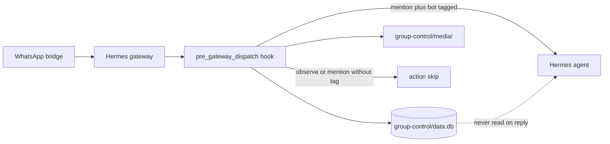

# hermes-group-control

A [Hermes Agent](https://github.com/NousResearch/hermes-agent) plugin that **archives every WhatsApp group message** to a local SQLite database and optionally gates when the bot replies.

**No Hermes core patches required** — install under `~/.hermes/plugins/` and enable in config.

## What it does

| Mode | Archive messages | Copy media | Bot replies |
|------|------------------|------------|-------------|
| **observe** (default) | Yes | Yes | Never (even @mentions) |
| **mention** | Yes | Yes | Only when @mentioned |

- Hermes **never reads** the archive DB when generating replies — it uses the normal session DB only.
- Ingest path uses **zero LLM** calls (write-only archive).
- DMs are untouched (groups only).

## Architecture



1. Every inbound **group** message hits `on_pre_gateway_dispatch`.
2. Message + metadata are written to SQLite; media files are copied from bridge temp paths.
3. **Policy** returns `{"action": "skip"}` or allows dispatch to continue.
4. On reply (mention mode only), Hermes behaves exactly as without this plugin.

## Requirements

- [Hermes Agent](https://github.com/NousResearch/hermes-agent) v0.15+ with WhatsApp bridge configured
- Python 3.11+ (same environment as Hermes)
- Plugin hooks: `pre_gateway_dispatch` (built into Hermes)

## Installation

```bash
git clone https://github.com/BenitoJD/hermes-group-control.git \
  ~/.hermes/plugins/group-control

hermes plugins enable group-control
```

Or copy the folder manually to `~/.hermes/plugins/group-control/`.

## Configuration

Add to `~/.hermes/config.yaml`:

```yaml
plugins:
  enabled:
    - group-control

group_control:
  db_path: ~/.hermes/group-control/data.db
  media_dir: ~/.hermes/group-control/media
  media_max_mb: 50
  default_mode: observe
  admins:
    - "15551234567"   # your WhatsApp number: country code, no + sign

gateway:
  platforms:
    whatsapp:
      extra:
        require_mention: false
```

Add to `~/.hermes/.env`:

```bash
# Required to archive ALL group members' messages (not only allowlisted senders)
WHATSAPP_ALLOWED_USERS=*
```

See [examples/config.yaml.snippet](examples/config.yaml.snippet) for a full copy-paste block.

Restart the gateway:

```bash
hermes gateway restart
```

### Environment variables

| Variable | Description |
|----------|-------------|
| `GROUP_CONTROL_DB_PATH` | Override SQLite path |
| `GROUP_CONTROL_MEDIA_DIR` | Override media directory |
| `GROUP_CONTROL_MEDIA_MAX_MB` | Max media file size (default `50`) |
| `GROUP_CONTROL_DEFAULT_MODE` | `observe` or `mention` for new groups |
| `GROUP_CONTROL_ADMINS` | Extra admin numbers (comma/space separated) |

## Commands

Run inside a WhatsApp **group** (admins only):

| Command | Effect |
|---------|--------|
| `/gc mode observe` | Archive only; bot never replies |
| `/gc mode mention` | Archive + reply when @mentioned |

The group must have at least one archived message before mode can be changed.

## Data layout

```
~/.hermes/group-control/
  data.db          # SQLite archive
  media/
    <group_jid>/   # copied photos, videos, documents, etc.
```

### Schema

**groups**

| Column | Description |
|--------|-------------|
| `jid` | WhatsApp group JID (`...@g.us`) |
| `name` | Display name from bridge (may be JID prefix) |
| `mode` | `observe` or `mention` |
| `first_seen`, `last_seen` | ISO timestamps |

**messages**

| Column | Description |
|--------|-------------|
| `message_id` | Unique WhatsApp message id |
| `group_jid`, `sender_jid`, `sender_name` | Who / where |
| `body`, `ts`, `msg_type` | Content and type |
| `has_media`, `media_path`, `mime_type`, `media_size` | Media metadata |

### Query examples

```bash
python3 -c "
import sqlite3
c = sqlite3.connect('$HOME/.hermes/group-control/data.db')
for row in c.execute('SELECT sender_name, body, ts FROM messages ORDER BY ts DESC LIMIT 10'):
    print(row)
"
```

## How mention detection works

Uses `event.raw_message` from the WhatsApp bridge (same signals as Hermes’ built-in adapter):

- `botIds` and `mentionedIds` overlap
- Reply to a bot message (`quotedParticipant`)
- `@phone` in message body
- Messages starting with `/` (slash commands)

## Verification

After sending a message in a group:

```bash
# Gateway log should show skip in observe mode
grep group-control ~/.hermes/logs/gateway.log | tail -5

# DB should have rows
python3 -c "import sqlite3; print(sqlite3.connect('$HOME/.hermes/group-control/data.db').execute('SELECT COUNT(*) FROM messages').fetchone())"
```

### Running tests

From a Hermes source checkout with this plugin installed:

```bash
cd /path/to/hermes-agent
pytest /path/to/hermes-group-control/tests/test_group_control.py -q
```

## Limitations

- **WhatsApp groups only** — not Telegram, Slack, or DMs
- **Unofficial WhatsApp API** — use at your own risk; see [PRIVACY.md](PRIVACY.md)
- Bridge queue (~100 messages) may drop bursts under heavy load
- Group titles may show as JID prefixes until bridge metadata improves
- Stickers, locations, and polls are not captured by the bridge today
- No built-in search, export, or analytics (query SQLite yourself or add a Hermes skill later)

## What this plugin does *not* change

- No edits to `gateway/`, `hermes_cli/`, or the WhatsApp bridge
- Uses only the public `pre_gateway_dispatch` hook and `register(ctx)` plugin API

## License

MIT — see [LICENSE](LICENSE).

## Disclaimer

This project is not affiliated with Nous Research or Meta/WhatsApp. You are responsible for complying with WhatsApp’s terms of service and applicable privacy laws when archiving group conversations.
